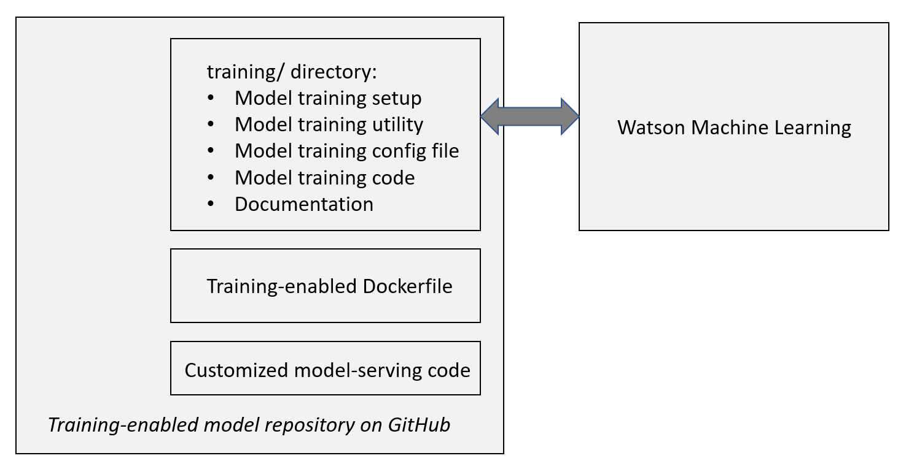

# Overview

Use this repository to enable a MAX model for training using Watson Machine Learning on the IBM Cloud. A training-enabled model repository includes the following components:




This repository contains the MAX model training skeleton files. To enable a MAX model for training complete the tasks listed below.

* [Task 1: Clone the model repository](#task-1-clone-the-model-repository) 
* [Task 2: Clone the training skeleton repository](#task-2-clone-the-training-skeleton-repository)
* [Task 3: Install and customize the training skeleton](#task-3-install-and-customize-the-training-skeleton) 
* [Task 4: Prepare the model training code](#task-4-prepare-the-model-training-code)
* [Task 5: Update the Dockerfile](#task-5-update-the-dockerfile)
* [Task 6: Configure your environment for testing](#task-6-configure-your-environment-for-testing)
* [Task 7: Verify that model training works as expected](#task-7-verify-that-model-training-works-as-expected)
* [Task 8: Customize the model-serving code as required](#task-8-customize-the-model-serving-code-as-required)
* [Task 9: Add data preparation instructions](#task-9-add-data-preparation-instructions)
* [Task 10: Upload pre-trained model assets to the production COS](#task-10-upload-pre-trained-model-assets-to-the-production-cos)
* [Task 11: Customize the model training README](#task-11-customize-the-model-training-readme)
* [Task 12: Update the model readme](#task-11-update-the-model-readme)

---

# How to enable a MAX model for training

## Task 1: Clone the model repository

1. Clone the desired MAX model repository, e.g. `https://github.com/IBM/MAX-Object-Detector`,  into a temporary location.

    ```
    $ pwd
     my-working-directory
    $ git clone https://github.com/IBM/MAX-...
     ...
      
    ```

   > The subsequent tasks will modify the content of this cloned directory.
   

1. Take note of the cloned directory location. 

    ```
    $ ls *
    MAX-...
    ```
    
    > The instructions in this document refer to this location as `$MODEL_REPO_HOME` (but there is no such evironment variable defined!)

The subsequent tasks will modify the content of this directory to enable the model for training with custom data.

## Task 2: Clone the training skeleton repository

The training skeleton repository contains the MAX model-training framework code, which is model agnostic.

1. Clone the training skeleton repository into a temporary location

    ```
    $ pwd 
     <my-working-directory>
    $ git clone https://github.com/IBM/MAX-Training-Skeleton
    $ cd MAX-Training-Skeleton
    $ pwd
     <my-working-directory>/MAX-Training-Skeleton
    ```

    > The instructions in this document refer to this location as `$SKELETON_HOME` (but there is no such evironment variable defined!)

## Task 3: Install and customize the training skeleton

The skeleton installer requires Python 3.6 or above. It is recommended that you start with a clean Python environment.

1. In `$SKELETON_HOME` launch the training skeleton installation program. 

    The `install_training_skeleton.sh` shell script installs the training skeleton
    Python dependencies and launches the program. 

    ```
    $ ./install_training_skeleton.sh
    ```

    > To only run the installer: `python install_training_skeleton.py` 

    The installer copies the training skeleton files to the `$MODEL_REPO_HOME/training` directory and creates a model-specific training configuration YAML file in that location using the information you are entering whenever prompted.

    > The installer will abort if `$MODEL_REPO_HOME/training` already exists. (Delete the directory to start over.) 

1. Follow the prompts.

    Whenever possible, a meaningful default value is provided. Hit `ENTER` to accept the default.

    ```
    Model name [MAX Object Detector]: <ENTER> 
    Model identifier [max-object-detector]: <ENTER>
    Model description [Localize and identify multiple objects in a single image.]: <ENTER>
    ```
    > **If no meaningful default is displayed [open an issue](https://github.com/IBM/MAX-Training-Skeleton/issues).** (The default values are derived from information in `$MODEL_REPO_HOME`.)

    You will be prompted to select the model's _deep learning framework_ and _serialization format_. (If you don't know check how the Docker-based microservice loads the model.)

    ```
    Deep learning framework:
     1. TensorFlow
     2. Keras
     Pick one: 1
    tensorflow model serialization format:
     1. Checkpoint
     2. Frozen graph definition
     3. Saved model
     Pick one: 1
    ```

    > **If none of the displayed options applies to the model STOP and [open an issue](https://github.com/IBM/MAX-Training-Skeleton/issues).** We will update the training skeleton to add support, as documented [here](https://github.com/IBM/MAX-Training-Skeleton/wiki/Add-support-for-a-new-framework-or-serialization-format).

    You will be prompted to specify an optional _Training data key prefix_. 
    
    ```
    Training data key name prefix: <ENTER>
    ```
    
    By default WML makes training data automatically available in a local directory that's identified by the `DATA_DIR` environment variable, e.g. `/some/random/path/`. You can optionally specify a subdirectory name by defining a key prefix.
    For example, if your training code expects training data to be stored in a subdirectory named `data`, you must set the key prefix to `data/`.  Your code can then access the files in `$DATA_DIR/data`.
    
Upon completion of this task, the model repository contains the model training framework along with its configuration files:

```
$ ls $MODEL_REPO_HOME/training
 train_max_model.py
 setup_max_model_training.py
 requirements.txt
 max-...-training-config.yaml
 sample_training_data/
 training_code/
 data_preparation/
```

- `train_max_model.py` - The training script that the end-user will run to train the model. This is the core of the training framework.
- `setup_max_model_training.py` - The user must run this script to configure model training prior to running `wml_train.py`.
- `requirements.txt` - Identifies prerequisite packages
- `max-...-training-config.yaml` - The model-specific configuration file that `wml_train.py` uses to perform model training. The end-user updates this file using `wml_setup.py`.
- `sample_training_data/` - This dicrectory contains optionally a small training data set that the end-user can use to train the model. (to understand the flow etc)
- `training_code/` - This directory will contain the model-specific training code that YOU provide.
- `data_preparation/` - This directory will contain the model-specific data preparation instructions and code that YOU provide.

> Note: The utility also updates `.gitignore` and `.dockerignore` in $MODEL_REPO_HOME.

## Task 4: Prepare the model training code

The model training code must produce artifacts that the model-serving code in the Docker image can consume. Most likely you will have to customize/generalize the existing model-serving code and the model-building code to find the right balance.
Typical issues:
 - The model serving code loads a model from the `my-saved-state.pb` file. Your original training code might save the model in `my-state.pb`. You need to pick one or the other. Continue reading.
 - The model serving code loads a model from the `my-saved-state-05-05-2018.pb` file, which contains a date (or version or data set name) in the name. Your model building code should not try to save the model under this name because the date, version or data set name have lost their meaning (the model was trained on a different name, using a different data set, etc). In this case you should pick a general name that is semantically correct for both - the pre-trained model and a custom-trained model. (This requires changes to the artifacts stored on COS, but that's okay.)
 - The model-serving code extracts the model artifacts from a compressed archive (e.g. if model-serving supports multiple model flavors). Therefore the custom model training/packaging code must produce a compressed archive with the same name.
 

### Collect model-serving information
How model-serving has been implemented has a major impact on model training code and model packaging code. At a minimum you must collect the following information:
 - Does the model-serving code (not the `Dockerfile`!) process one or more compressed archive(s)? 
    - Note the names
    - Document the archive structure
 - Does the model-serving code (not the `Dockerfile`!) process serialized model files?
    - Note the names


### Build and test the model training code

1. Place your model training code that WML will run into the `$MODEL_REPO_HOME/training/training_code/` directory.
1. Customize `$MODEL_REPO_HOME/training/training_code/train-max-model.sh` by following the embedded instructions.
1. Add packages that your model training code requires to `$MODEL_REPO_HOME/training/training_code/training_requirements.txt`. 

   > `$MODEL_REPO_HOME/training/training_code/train-max-model.sh` will install the listed requirements when WML starts the training run.

**DO**:
- Add a small _ready-to-use_ sample data set to `$MODEL_REPO_HOME/training/sample_training_data/`. The training framework will upload the content of this directory to the training data bucket in Cloud Object Storage, if that bucket _is empty_. Note that training data must reside in the `sample_training_data/data` subdirectory.
- Update README files with model-specific information that a user might find useful.

**DO NOT**:
- Modify any source code in `$MODEL_REPO_HOME/training/` (aside from files in `$MODEL_REPO_HOME/training/training_code/`).

## Task 5: Update the Dockerfile

 Review the training-enabled [Dockerfile recipe](https://github.com/IBM/MAX-Training-Skeleton/blob/master/docs/Dockerfile_recipe_README.md) and apply the relevant parts to the model's original `Dockerfile`.

## Task 6: Configure your environment for testing

> You should always test in a clean environment (e.g. by creating a brand-new conda environment that does not have any of the prerequites pre-installed. 

1. Install the training framework/setup prerequisites

   ```
   $ pwd
    $MODEL_REPO_HOME/training
   $ pip install -r requirements.txt
     ...
   $ python setup_max_model_training.py <max-model-name-training-config>.yaml
     ...
   ```
   
   > If `setup_max_model_training.py` or `train_max_model.py` fails at any time due to a missing package open an issue. We will update the `requirements.txt` in the training skeleton as necessary. 
   
 2. Upon completion, `setup_max_model_training.py` should display a set of environment variables that you need to define.  
   
## Task 7: Verify that model training works as expected
   
1. Launch the training utility `train_max_model.py` in `$MODEL_REPO_HOME/training/` to review its options.

   ```
   $ pwd
    $MODEL_REPO_HOME/training

   $ python train_max_model.py
   ```

1. Prepare for training. This step creates the required buckets in COS, uploads the training data (if required), and creates the WML model building code archive.

   ```
   $ python train_max_model.py <max-model-name-training-config>.yaml prepare
   ```

1. Inspect the content of the generated model building code archive `<max-model-name>-model-building-code.zip`. This archive is sent to WML when the training is started.

1. Train the model and package the artifacts.

   ```
   $ python train_max_model.py <max-model-name-training-config>.yaml package
   ```
   
1. Review the output and the downloaded training log file `training-log.txt`. No errors should be reported.


## Task 8: Customize the model-serving code as required

The model-serving code in `$MODEL_REPO_HOME/` might require some changes based on how your model was trained and packaged. If appropriate change the model serving code to accomodate new requirements. If necessary re-package the originally published model assets.


### Verify that the model-serving code works as expected for the pre-trained model assets and the custom-trained model assets.

1. Run docker image build using the `--build-arg use_pre_trained_model=true` build argument
1. Launch the Docker image and verify that model-serving yields the expected results.
1. Run docker image build using the `--build-arg use_pre_trained_model=false` build argument
1. Launch the Docker image and verify that model-serving yields the expected results.

## Task 9: Add data preparation instructions

The `$MODEL_REPO_HOME/training/data_preparation` directory includes a README template file. Update the template and add code or examples as required.

## Task 10: Upload pre-trained model assets to the production COS

OPTIONAL: To easily support pre-trained and custom-trained models it might sometimes be necessary to replace the original model assets on COS. For example, a model asset might be named `model-0506-2018.pb`. Because it wouldn't make semantically sense for model training to produce a file named `model-0506-2018.pb` (`0506-2018 representing a date`), the model serving code would have to be enabled to use different names (one for the pre-trained model and one for the custom-trained model). To keep things simple you might therefore decide to re-package the original artifacts. 

Sometimes it might After testing has completed upload the re-packaged model assets to the production COS.

## Task 11: Customize the model training README

Customize the pre-configured `training/README.md` file following the steps listed in the file's header.

## Task 12: Update the model README

Make sure the model's `README.md` file includes a _How to train this model_ section, as shown in https://github.com/IBM/MAX-Skeleton/blob/master/README-template.md
